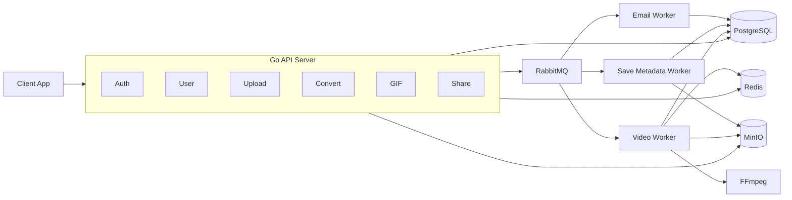
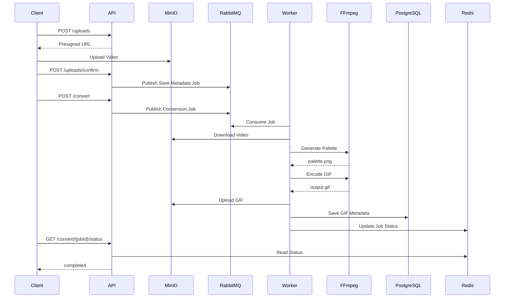
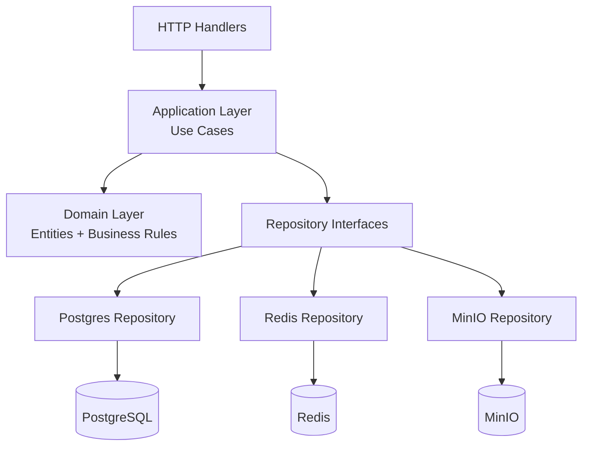

# FFGif

A video-to-GIF conversion SaaS API. Users upload videos, configure conversion parameters (start/end time, FPS, width, loop), and receive a GIF which can be downloaded and shared. Built to explore async job processing, object storage, and production-grade backend patterns in Go.

> **Status**: Core backend functional. Frontend not yet ready. Active refactor toward Domain-Driven Design (DDD) in progress.

---

## Features

- JWT-based authentication with email verification, forgot/reset password flow, and token blocklisting on logout
- Presigned URL upload and download flow — client uploads directly to MinIO, backend is never in the video data path
- Async GIF conversion via RabbitMQ worker pool — FFmpeg processes video locally, result uploaded back to MinIO
- Per-user quota tracking (storage bytes, GIF count)
- GIF management: list, get, delete, visibility status (public/private), download URL
- Redis token bucket rate limiter implemented via a Lua script for atomic server-side enforcement

---

## Architecture

### High-Level System Architecture



<details>
<summary><strong>Video Conversion Workflow</strong></summary>



</details>

<details>
<summary><strong>DDD Target Architecture</strong></summary>



</details>

---

## Tech Stack

| Component | Technology |
|-----------|-----------|
| Language | Go 1.25 |
| HTTP | `net/http` (stdlib, no framework) |
| Database | PostgreSQL via `sqlx` |
| Migrations | `golang-migrate` |
| Cache | Redis via `go-redis` |
| Object Storage | MinIO (`minio-go`) |
| Message Queue | RabbitMQ (`amqp091-go`) |
| Video Processing | FFmpeg (via `os/exec`) |
| Auth | JWT (`golang-jwt/jwt`) + bcrypt + pepper |
| Validation | `go-playground/validator` |
| Email | Mailtrap (SMTP sandbox) |

---

## Project Structure

```
.
├── cmd/                  # Entry point, dependency wiring
├── config/               # Env-based config loading
├── infra/
│   ├── cache/redis/      # Redis client + rate limit Lua script
│   ├── db/postgres/      # Connection, setup, migrations
│   ├── queue/rabbitmq/   # Connection, queue declarations, publishers
│   ├── minio/            # MinIO client setup
│   └── worker/           # Email, video, save-metadata workers
├── model/                # Structs (flat, pre-DDD)
├── repo/                 # Repository interfaces + implementations
├── rest/
│   ├── handlers/         # HTTP handlers (auth, user, gif, uploader, converter, share, admin)
│   └── middleware/       # Auth, CORS, rate limiter, logger, max body
├── utils/                # JWT, hashing, token generation, FFmpeg wrapper, mailer
├── migrations/           # SQL up/down files
├── Makefile
└── .env.example
```

---

## .env Variables

```
VERSION=1.0.0                 # Project version
SERVICE_NAME=ffgif            # Project name
PORT=8080                     # port to live

JWT_SECRET=                   # 
HASH_PEPPER=                  #
BCRYPT_COST=12                # make password hash stronger

DB_USER=                      # DB user name
DB_PASSWORD=                  # 
DB_PORT=                      #
DB_ADDRESS=                   #
DB_NAME=                      #
DB_SSLMODE=                   #

DB_SUPERUSER=                 # DB root user
DB_SUPERDB=                   # DB root database name

REDIS_ADDR=                   #
REDIS_USER=                   #
REDIS_PASS=                   #

EMAIL=                        # sender's email
MAILTRAP_USERNAME=            #
MAILTRAP_PASSWORD=            #

ENDPOINT=                     # MinIO address
ACCESS_KEY_ID=                # 
SECRET_ACCESS_KEY=            #
BUCKET_NAME=                  #
```

---

## Getting Started

```bash
git clone https://github.com/labib0x9/FFgif.git
cd ffgif

cp .env.example .env
# edit .env — Postgres, Redis, MinIO, Mailtrap, JWT secret

make services   # starts Postgres, Redis, RabbitMQ, MinIO (macOS/Homebrew)
make backend    # go run main.go
```

Migrations run automatically on startup.
---

## API Reference

### Auth
```
POST   /auth/signup
POST   /auth/login
GET    /auth/logout              (auth required)
GET    /auth/verify?token=
POST   /auth/verify/resend
POST   /auth/forgot-password
GET    /auth/reset?token=
POST   /auth/reset
```

### User
```
GET    /users/profile/me         (auth required)
PATCH  /users/profile/me         (auth required)
GET    /users/me/quota           (auth required)
PATCH  /users/change-password    (auth required)
DELETE /users/me                 (auth required)
```

### Uploads
```
POST   /uploads                  presigned URL generation
GET    /uploads/{key}/status
GET    /uploads/{key}/stream     byte-range streaming
GET    /uploads/last             last uploaded video metadata
POST   /uploads/confirm          trigger save-metadata job
```

### Convert
```
POST   /convert                  enqueue conversion job
GET    /convert/{jobId}/status   poll job status from Redis
```

### GIFs
```
GET    /gifs/me
GET    /gifs/me/recents
GET    /gifs/me/{key}
GET    /gifs/me/{key}/download
PATCH  /gifs/me/{key}
DELETE /gifs/me/{key}
POST   /gifs/me/recents/{key}/save
```

### Shares
```
POST   /gifs/me/{id}/shares
GET    /gifs/me/{id}/shares
PATCH  /gifs/me/{id}/shares/{shareId}
DELETE /gifs/me/{id}/shares/{shareId}
GET    /s/{token}                public view (no auth)
GET    /s/{token}/download       public download (no auth)
```

---

## Known Limitations

- **No frontend**: The frontend is not yet built. All endpoints are currently tested manually (postman).
- **Share handlers are stubs**: Routes are registered and the schema is migrated, but handler logic is commented out pending design decisions.
- **Anonymous user flow is incomplete**: The demo/guest account path exists in the schema and some repo code but is commented out at the handler layer.
- **No input validation on convert parameters**: Start/end time, FPS, and width are passed to FFmpeg without range validation — a malformed request can produce an unhelpful FFmpeg error rather than a clean 400.
- **Single MinIO bucket**: Raw uploads and converted GIFs share one bucket. There is no lifecycle policy to expire unconverted raw files.
- **`OneTimePerEmail` and `BlockIP` middlewares are stubs**: The rate-limiting middleware for sensitive auth endpoints is not yet implemented (currently pass-through).
- **No HTTPS / TLS**: Local dev only, no TLS configuration.
- **No integration or unit tests**: Test coverage is zero.
- **Job status stored only in Redis with 5-minute TTL**: If a client polls after expiry, the status is gone. There is no persistent job record in Postgres.
- **Flat architecture**: Currently `model/`, `repo/`, `rest/` are flat packages. Active migration to DDD is underway (see Current Work).
- **No transaction**: Currently databases has no transactions, so it doesn't follow any ACID principle.

---

## Planned / Future Work

- Implement frontend (React + Vite)
- Implement Transaction on database query at application level
- Implement `OneTimePerEmail` and `BlockIP` middleware
- Persistent job records in Postgres (replace Redis-only job status)
- Input validation for conversion parameters (start < end, FPS/width bounds)
- Separate MinIO buckets for raw uploads and GIFs; lifecycle policy to expire raw files
- Unit and integration tests (repository layer, use cases)
- Complete share handler implementation
- Complete anonymous user flow
- GIF metadata enrichment: file size, dimensions, duration stored in the gifs table
- Anonymous user accounts with 24-hour TTL and upgrade-to-registered path (partially implemented)
- Admin endpoints
- Graceful shutdown with signal handling
- Docker Compose for full local stack