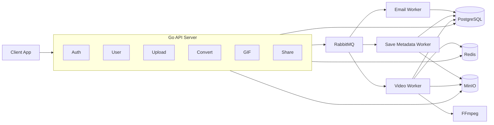
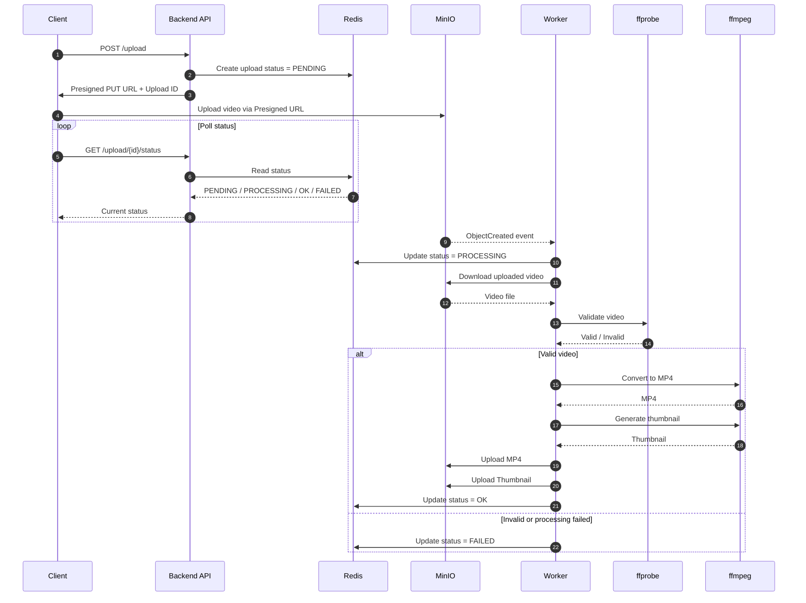
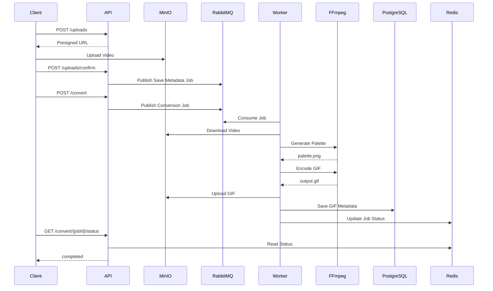

# FFGif

A video-to-GIF conversion platform. Users upload videos, configure conversion parameters (start/end time, FPS, width, loop), and receive a GIF which can be downloaded and shared. Built to explore async job processing, object storage, and production-grade backend patterns in Go.

---

## Features

- **JWT-based Authentication:** Signup with email verification, login, forgot/reset password flow, and token blocklisting on logout
- **Presigned URL upload and download flow:** Client uploads and downloads directly from MinIO, backend never touches the bytes
- **Event-driven ingestion:** MinIO bucket notifications trigger RabbitMQ on upload, decoupling ingestion from processing
- **Async GIF conversion via RabbitMQ worker pool:** FFmpeg processes video locally, result uploaded back to MinIO
- **GIF management:** list, get, delete, visibility status (public/private), download URL
- **Rate Limiter:** Redis token bucket rate limiter implemented via a Lua script for atomic server-side enforcement
- **Retry & dead-letter handling:** Failed conversion jobs retry with backoff before routing to a dead-letter queue
- **Mail sending:** Emails are send via smtp

---

## Architecture

### High-Level System Architecture


```mermaid
flowchart LR

    Client["Client App"]

    subgraph API["Go API Server"]
        Auth["Auth"]
        User["User"]
        Upload["Upload"]
        Convert["Convert"]
        GIF["GIF"]
        Share["Share"]
    end

    PG[("PostgreSQL")]
    Redis[("Redis")]
    MinIO[("MinIO")]
    RabbitMQ["RabbitMQ"]

    EmailWorker["Email Worker"]
    VideoWorker["Video Worker"]
    SaveWorker["Save Metadata Worker"]

    FFmpeg["FFmpeg"]

    Client --> API

    API --> PG
    API --> Redis
    API --> MinIO
    API --> RabbitMQ

    RabbitMQ --> EmailWorker
    RabbitMQ --> VideoWorker
    RabbitMQ --> SaveWorker

    EmailWorker --> PG

    SaveWorker --> PG
    SaveWorker --> MinIO

    VideoWorker --> MinIO
    VideoWorker --> FFmpeg
    VideoWorker --> PG
    VideoWorker --> Redis
```

<details>
<summary><strong>Video Upload Workflow</strong></summary>


```mermaid
sequenceDiagram
    autonumber

    participant Client
    participant API as Backend API
    participant Redis
    participant MinIO as MinIO
    participant Worker
    participant FFProbe as ffprobe
    participant FFmpeg as ffmpeg

    Client->>API: POST /upload
    API->>Redis: Create upload status = PENDING
    API->>Client: Presigned PUT URL + Upload ID

    Client->>MinIO: Upload video via Presigned URL

    loop Poll status
        Client->>API: GET /upload/{id}/status
        API->>Redis: Read status
        Redis-->>API: PENDING / PROCESSING / OK / FAILED
        API-->>Client: Current status
    end

    MinIO-->>Worker: ObjectCreated event

    Worker->>Redis: Update status = PROCESSING

    Worker->>MinIO: Download uploaded video
    MinIO-->>Worker: Video file

    Worker->>FFProbe: Validate video
    FFProbe-->>Worker: Valid / Invalid

    alt Valid video
        Worker->>FFmpeg: Convert to MP4
        FFmpeg-->>Worker: MP4

        Worker->>FFmpeg: Generate thumbnail
        FFmpeg-->>Worker: Thumbnail

        Worker->>MinIO: Upload MP4
        Worker->>MinIO: Upload Thumbnail

        Worker->>Redis: Update status = OK
    else Invalid or processing failed
        Worker->>Redis: Update status = FAILED
    end
```

</details>

<details>
<summary><strong>Video Conversion Workflow</strong></summary>


```mermaid
sequenceDiagram

    participant Client
    participant API
    participant MinIO
    participant RabbitMQ
    participant Worker
    participant FFmpeg
    participant PostgreSQL
    participant Redis

    Client->>API: POST /uploads

    API-->>Client: Presigned URL

    Client->>MinIO: Upload Video

    Client->>API: POST /uploads/confirm

    API->>RabbitMQ: Publish Save Metadata Job

    Client->>API: POST /convert

    API->>RabbitMQ: Publish Conversion Job

    Worker->>RabbitMQ: Consume Job

    Worker->>MinIO: Download Video

    Worker->>FFmpeg: Generate Palette

    FFmpeg-->>Worker: palette.png

    Worker->>FFmpeg: Encode GIF

    FFmpeg-->>Worker: output.gif

    Worker->>MinIO: Upload GIF

    Worker->>PostgreSQL: Save GIF Metadata

    Worker->>Redis: Update Job Status

    Client->>API: GET /convert/{jobId}/status

    API->>Redis: Read Status

    API-->>Client: completed
```

</details>

---

## Tech Stack

| Component        | Technology                               |
| ---------------- | ---------------------------------------- |
| Language         | Go 1.25                                  |
| HTTP             | `net/http` (stdlib, no framework)        |
| Database         | PostgreSQL via `sqlx`                    |
| Migrations       | `golang-migrate`                         |
| Cache            | Redis via `go-redis`                     |
| Object Storage   | MinIO (`minio-go`)                       |
| Message Queue    | RabbitMQ (`amqp091-go`)                  |
| Video Processing | FFmpeg (via `os/exec`)                   |
| Auth             | JWT (`golang-jwt/jwt`) + bcrypt + pepper |
| Validation       | `go-playground/validator`                |
| Email            | Mailtrap (SMTP sandbox)                  |

---

## Project Structure

```
.
├── cmd/                            # Entry point, dependency wiring
│   ├── ffgif/                      #
│   └── bootstrap/                  #
├── config/                         # Env-based config loading
├── internal/                       #
│   ├── app/                        # Application Layer
│   │   ├── auth/                   #
│   │   ├── job/                    #
│   │   ├── media/                  #
│   │   ├── share/                  #
│   │   └── user/                   #
│   ├── domain/                     # Domain Layer
│   │   ├── auth/                   #
│   │   ├── cache/                  #
│   │   ├── db/                     #
│   │   ├── job/                    #
│   │   ├── mailer/                 #
│   │   ├── media/                  #
│   │   ├── processor/              #
│   │   ├── queue/                  #
│   │   ├── share/                  #
│   │   └── user/                   #
│   ├── infra/                      # Infra Layer
│   │   ├── gifprocessor/           #
│   │   ├── minio/                  #
│   │   ├── postgres/               #
│   │   ├── rabbitmq/               #
│   │   └── redis/                  #
│   │       ├── cache/              #
│   │       ├── rate_limiter/       #
│   ├── transport/                  # Transport Layer
│   │   └── http/                   #
│   │       ├── handlers/           #
│   │       │   ├── admin/          #
│   │       │   ├── auth/           #
│   │       │   ├── job/            #
│   │       │   ├── media/          #
│   │       │   ├── share/          #
│   │       │   ├── static/         #
│   │       │   └── user/           #
│   │       ├── middleware/         #
│   │       └── server.go           #
│   └── worker/                     # RabbitMq worker
├── migrations/                     # SQL migrations up/down files
├── pkg/                            # Packages
│   ├── ffmpeg/                     #
│   ├── jsonio/                     #
│   ├── jwt/                        #
│   ├── mailer/                     #
│   ├── password/                   #
│   ├── random/                     #
│   └── token/                      #
├── static/                         # Frontend codes (Claude generated)
├── scripts/                        # Script files
├── .gitignore
├── .env.example                    # Environment variables
├── .dockerignore
├── docker-compose.yml
├── Dockerfile
├── go.mod
├── go.sum
└── README.md                       #
```

---

## Setup

### Prerequisites

- Docker

### Environment

Copy `.env.example` to `.env` and fill in your values:

```env
VERSION=                        # Project version
SERVICE_NAME=                   # Project name
ADDR=
PORT=

JWT_SECRET=                     # Auth
HASH_PEPPER=
BCRYPT_COST=

PG_USER=                        # PostgreSql
PG_PASSWORD=
PG_PORT=
PG_ADDRESS=
PG_NAME=
PG_SSLMODE=

PG_SUPERUSER=
PG_SUPERDB=

REDIS_ADDR=                     # Redis

EMAIL=                          # Mailtrap
MAILTRAP_USERNAME=
MAILTRAP_PASSWORD=

MINIO_ADDR=                     # Minio
MINIO_ROOT_USER=
MINIO_ROOT_PASSWORD=
MINIO_TEMP_BUCKET=              # raw upload bucket
MINIO_PERSIST_BUCKET=           # mp4 converted storage bucket
MINIO_TEMP_BUCKET_TTL_DAYS=     # time to delete raw uploaded file
MINIO_API_CORS_ALLOW_ORIGIN=    # minio cors
MINIO_NOTIFY_EXCHANGE=          # rabbitmq exhange name where minio will send notification
MINIO_PUBLIC_ENDPOINT=          # rabbitmq public endpoint where client requests

RMQ_ADDR=                       # Rabbitmq
RMQ_USER=
RMQ_PASS=

SMTP_HOST=                      # SMTP for sending email
SMTP_PORT=
SMTP_USER=
SMTP_PASS=
```

### Build And Run

```
docker compose up -d --build
```

### Run

```
docker compose up
```

### Docker services

```
services:
  postgres:   → PostgreSQL
  redis:      → Redis
  rabbitmq:   → RabbitMQ
  minio       → MinIO
  bootstrap:  → CLI to setup postgres, redis and rabbitmq
  api:        → API backend and frontend
```

### Demo login

```
Email: anonymous@ffgif.local
Pass: anonymous@ffgif
```

### Mail send

```
Option 1:
1. use https://mailtrap.io/ sandbox for testing

mailer := mailer.NewMailtrap(cnf)

Option 2:
1. goto  https://myaccount.google.com/apppasswords
2. get new password for mail

mailer := mailer.NewSmtpMailer(cnf)
```

---

## API Reference

### Auth

```
POST   /auth/signup
POST   /auth/login
GET    /auth/logout              (auth required)
GET    /auth/verify?token=
POST   /auth/verify/resend
POST   /auth/forgot-password
GET    /auth/reset?token=
POST   /auth/reset
```

### User

```
GET    /users/profile/me         (auth required)
PATCH  /users/profile/me         (auth required)
GET    /users/me/quota           (auth required)
PATCH  /users/change-password    (auth required)
DELETE /users/me                 (auth required)
```

### Uploads

```
POST   /uploads                  presigned URL generation
GET    /uploads/{key}/status     poll upload status from Redis
GET    /uploads/{key}/stream     presigned URL streaming
GET    /uploads/last             last uploaded video metadata
```

### Convert

```
POST   /convert                  enqueue conversion job
GET    /convert/{jobId}/status   poll job status from Redis
```

### GIFs

```
GET    /gifs/me
GET    /gifs/me/recents
GET    /gifs/me/{key}
GET    /gifs/me/{key}/download
PATCH  /gifs/me/{key}
DELETE /gifs/me/{key}
POST   /gifs/me/recents/{key}/save
```

### Shares

```
POST   /gifs/me/{id}/shares
GET    /gifs/me/{id}/shares
PATCH  /gifs/me/{id}/shares/{shareId}
DELETE /gifs/me/{id}/shares/{shareId}
GET    /s/{token}                public view (no auth)
GET    /s/{token}/download       public download (no auth)
```

---

## Known Limitations

- **Limited frontend**: minimal frontend is build to test using claude.
- **Share handlers are stubs**: Routes are registered and the schema is migrated, but handler logic is commented out pending design decisions.
- **Anonymous user flow is incomplete**: The demo/guest account path exists in the schema and some repo code but is commented out at the handler layer.
- **No input validation on convert parameters**: Start/end time, FPS, and width are passed to FFmpeg without range validation — a malformed request can produce an unhelpful FFmpeg error rather than a clean 400.
- **`OneTimePerEmail` and `BlockIP` middlewares are stubs**: The rate-limiting middleware for sensitive auth endpoints is not yet implemented (currently pass-through).
- **No HTTPS / TLS**: Local dev only, no TLS configuration.
- **No integration or unit tests**: Test coverage is zero.
- **Job status stored only in Redis with 5-minute TTL**: If a client polls after expiry, the status is gone. There is no persistent job record in Postgres.
- **No transaction**: Currently databases has no transactions, so it doesn't follow any ACID principle.

---

## Planned / Future Work

- Per-user quota tracking (storage bytes, GIF count)
- Implement frontend (React + Vite)
- Persistent job records in Postgres (replace Redis-only job status)
- Input validation for conversion parameters (start < end, FPS/width bounds)
- Unit and integration tests (repository layer, use cases)
- Complete share handler implementation
- Complete anonymous user flow
- GIF metadata enrichment: file size, dimensions, duration stored in the gifs table
- Anonymous user accounts with 24-hour TTL and upgrade-to-registered path
- Admin endpoints
