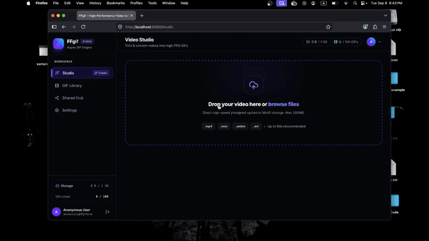
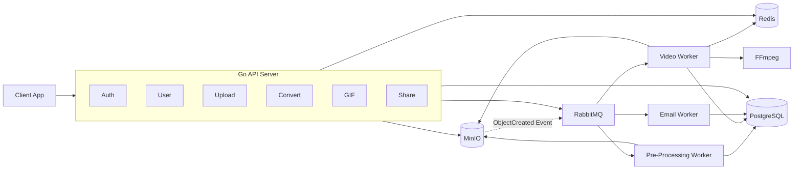
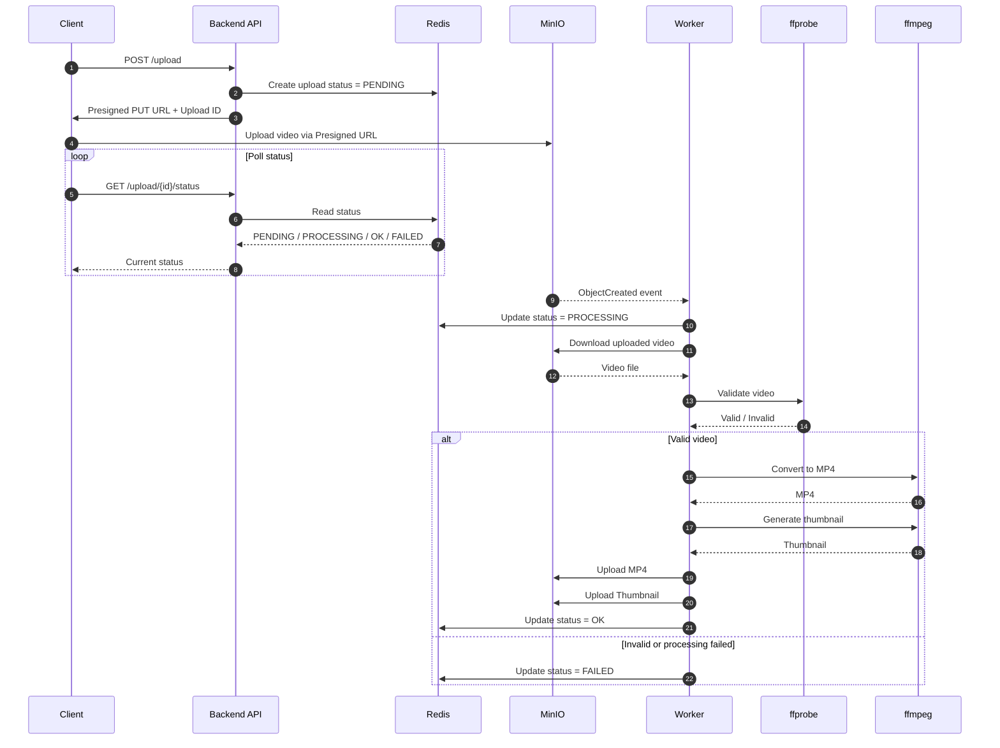
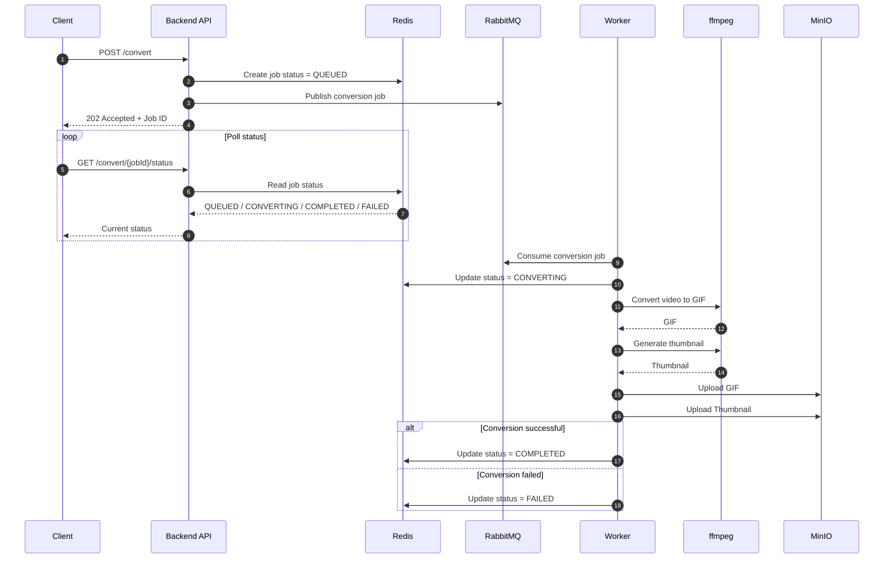

# FFGif

A video-to-GIF conversion platform. Users upload videos, configure conversion parameters (start/end time, FPS, width, loop), and receive a GIF which can be downloaded and shared. Built to explore async job processing, object storage, and production-grade backend patterns in Go.

---

## Project Demo

<p align="center">
  
</p>

---

## Features

- **JWT-based Authentication:** Signup with email verification, login, forgot/reset password flow, and token blocklisting on logout (Redis-backed)
- **Presigned URL upload and download flow:** Client uploads and downloads directly from MinIO, backend never touches the bytes
- **Event-driven ingestion:** MinIO bucket notifications trigger RabbitMQ on upload, decoupling ingestion from processing
- **Async GIF conversion via RabbitMQ worker pool:** FFmpeg processes video locally, result uploaded back to MinIO
- **GIF management:** list, get, delete, visibility status (public/private), download URL, sharing with others users or publicly by email
- **GIF sharing with access control:** owners can grant time-limited access to another registered user or publicly; shared recipients can download without owning the GIF
- **Rate Limiter:** Redis token bucket rate limiter implemented via a Lua script for atomic server-side enforcement
- **Email delivery** via SMTP (Mailtrap sandbox or SMTP)

---

## Architecture

### High-Level System Architecture


```mermaid
flowchart LR

    Client["Client App"]

    subgraph API["Go API Server"]
        Auth["Auth"]
        User["User"]
        Upload["Upload"]
        Convert["Convert"]
        GIF["GIF"]
        Share["Share"]
    end

    PG[("PostgreSQL")]
    Redis[("Redis")]
    MinIO[("MinIO")]
    RabbitMQ["RabbitMQ"]

    PreWorker["Pre-Processing Worker"]
    VideoWorker["Video Worker"]
    EmailWorker["Email Worker"]

    FFmpeg["FFmpeg"]

    Client --> API

    API --> PG
    API --> Redis
    API --> MinIO
    API --> RabbitMQ

    %% Upload pipeline
    MinIO -. ObjectCreated Event .-> RabbitMQ
    RabbitMQ --> PreWorker
    PreWorker --> MinIO
    PreWorker --> PG

    %% Conversion pipeline
    RabbitMQ --> VideoWorker
    VideoWorker --> MinIO
    VideoWorker --> FFmpeg
    VideoWorker --> Redis
    VideoWorker --> PG

    %% Email pipeline
    RabbitMQ --> EmailWorker
    EmailWorker --> PG
```

<details>
<summary><strong>Video Upload Workflow</strong></summary>


```mermaid
sequenceDiagram
    autonumber

    participant Client
    participant API as Backend API
    participant Redis
    participant MinIO as MinIO
    participant Worker
    participant FFProbe as ffprobe
    participant FFmpeg as ffmpeg

    Client->>API: POST /upload
    API->>Redis: Create upload status = PENDING
    API->>Client: Presigned PUT URL + Upload ID

    Client->>MinIO: Upload video via Presigned URL

    loop Poll status
        Client->>API: GET /upload/{id}/status
        API->>Redis: Read status
        Redis-->>API: PENDING / PROCESSING / OK / FAILED
        API-->>Client: Current status
    end

    MinIO-->>Worker: ObjectCreated event

    Worker->>Redis: Update status = PROCESSING

    Worker->>MinIO: Download uploaded video
    MinIO-->>Worker: Video file

    Worker->>FFProbe: Validate video
    FFProbe-->>Worker: Valid / Invalid

    alt Valid video
        Worker->>FFmpeg: Convert to MP4
        FFmpeg-->>Worker: MP4

        Worker->>FFmpeg: Generate thumbnail
        FFmpeg-->>Worker: Thumbnail

        Worker->>MinIO: Upload MP4
        Worker->>MinIO: Upload Thumbnail

        Worker->>Redis: Update status = OK
    else Invalid or processing failed
        Worker->>Redis: Update status = FAILED
    end
```

</details>

<details>
<summary><strong>Video Conversion Workflow</strong></summary>


```mermaid
sequenceDiagram
    autonumber

    participant Client
    participant API as Backend API
    participant Redis
    participant RabbitMQ
    participant Worker
    participant FFmpeg as ffmpeg
    participant MinIO

    Client->>API: POST /convert
    API->>Redis: Create job status = QUEUED
    API->>RabbitMQ: Publish conversion job
    API-->>Client: 202 Accepted + Job ID

    loop Poll status
        Client->>API: GET /convert/{jobId}/status
        API->>Redis: Read job status
        Redis-->>API: QUEUED / CONVERTING / COMPLETED / FAILED
        API-->>Client: Current status
    end

    Worker->>RabbitMQ: Consume conversion job

    Worker->>Redis: Update status = CONVERTING

    Worker->>FFmpeg: Convert video to GIF
    FFmpeg-->>Worker: GIF

    Worker->>FFmpeg: Generate thumbnail
    FFmpeg-->>Worker: Thumbnail

    Worker->>MinIO: Upload GIF
    Worker->>MinIO: Upload Thumbnail

    alt Conversion successful
        Worker->>Redis: Update status = COMPLETED
    else Conversion failed
        Worker->>Redis: Update status = FAILED
    end
```

</details>

---

## Tech Stack

| Component        | Technology                               |
| ---------------- | ---------------------------------------- |
| Language         | Go                                       |
| HTTP             | `net/http` (stdlib, no framework)        |
| Database         | PostgreSQL via `sqlx`                    |
| Migrations       | `golang-migrate`                         |
| Cache            | Redis via `go-redis`                     |
| Object Storage   | MinIO (`minio-go`)                       |
| Message Queue    | RabbitMQ (`amqp091-go`)                  |
| Video Processing | FFmpeg (via `os/exec`)                   |
| Auth             | JWT (`golang-jwt/jwt`) + bcrypt + pepper |
| Validation       | `go-playground/validator`                |
| Email            | Mailtrap (SMTP sandbox)                  |

---

## Project Structure

```
.
├── cmd/                            → Application entry points
│   ├── ffgif/                      # Main HTTP API server
│   ├── worker/                     # Async RabbitMQ background workers
│   └── bootstrap/                  # DB migrations & infra bootstrap CLI
├── config/                         → Environment-based configuration loader
├── dist/                           → Static frontend export
├── internal/                       → Private application code
│   ├── app/                        → Application use cases & services
│   │   ├── auth/                   # Authentication service (signup, login, reset)
│   │   ├── media/                  # Video upload, processing & GIF service
│   │   ├── share/                  # GIF sharing & access control service
│   │   └── user/                   # User profile & quota service
│   ├── domain/                     → Core domain entities & repository interfaces
│   │   ├── auth/                   # User, credential & verifier models
│   │   ├── media/                  # GIF, upload & storage models
│   │   ├── share/                  # GIF share models
│   │   └── user/                   # Profile & quota models
│   ├── port/                       → Port interfaces for external adapters
│   │   ├── cache/                  # Cache & rate limiter interfaces
│   │   ├── db/                     # Transaction manager interface
│   │   ├── mailer/                 # Mailer interface
│   │   ├── processor/              # Video & GIF processor interface
│   │   └── queue/                  # Message queue interface
│   ├── infra/                      → Infrastructure adapters & drivers
│   │   ├── ffmpeg/                 # FFmpeg/FFprobe CLI wrapper
│   │   ├── mailer/                 # SMTP / Mailtrap client
│   │   ├── minio/                  # MinIO S3 object storage adapter
│   │   ├── postgres/               # PostgreSQL repositories via sqlx
│   │   ├── rabbitmq/               # RabbitMQ publisher & consumer
│   │   └── redis/                  # Redis cache & Lua token bucket rate limiter
│   ├── transport/                  → Transport layer
│   │   └── http/                   → HTTP server & routing
│   │       ├── handlers/           # HTTP handlers (auth, media, share, user, static)
│   │       ├── httputil/           # JSON response & auth context helpers
│   │       ├── middleware/         # Auth, CORS, rate limiter, logger middlewares
│   │       └── server.go           # Server startup & routing configuration
│   └── worker/                     → RabbitMQ consumers (conversion, preprocessing, email)
├── migrations/                     → PostgreSQL schema migration files
├── pkg/                            → Shared reusable utility packages
│   ├── jwt/                        # JWT token generation & verification
│   ├── password/                   # Bcrypt password hashing with pepper
│   ├── random/                     # Cryptographic ID generator
│   └── token/                      # Random token generator
├── scripts/                        → Automation & deployment scripts
├── tests/                          → Test suites
│   └── integration/                # End-to-end and real infra integration tests
├── .env.example                    # Environment variables template
├── docker-compose.yml              # Local multi-service orchestrator
├── Dockerfile                      # Multi-stage Go build container
├── go.mod                          # Go module dependencies
├── go.sum                          # Go checksums
└── README.md                       # Project documentation
```

---

## Setup

### Prerequisites

- Docker

### Environment

Copy `.env.example` to `.env` and fill in your values:

```env
VERSION=                        # Project version
SERVICE_NAME=                   # Project name
ADDR=
PORT=

JWT_SECRET=                     # Auth
HASH_PEPPER=
BCRYPT_COST=

PG_USER=                        # PostgreSql
PG_PASSWORD=
PG_PORT=
PG_ADDRESS=
PG_NAME=
PG_SSLMODE=

PG_SUPERUSER=
PG_SUPERDB=

REDIS_ADDR=                     # Redis

EMAIL=                          # Mailtrap
MAILTRAP_USERNAME=
MAILTRAP_PASSWORD=

MINIO_ADDR=                     # Minio
MINIO_ROOT_USER=
MINIO_ROOT_PASSWORD=
MINIO_TEMP_BUCKET=              # raw upload bucket
MINIO_PERSIST_BUCKET=           # mp4 converted storage bucket
MINIO_TEMP_BUCKET_TTL_DAYS=     # time to delete raw uploaded file
MINIO_API_CORS_ALLOW_ORIGIN=    # minio cors
MINIO_NOTIFY_EXCHANGE=          # rabbitmq exhange name where minio will send notification
MINIO_PUBLIC_ENDPOINT=          # rabbitmq public endpoint where client requests

RMQ_ADDR=                       # Rabbitmq
RMQ_USER=
RMQ_PASS=

SMTP_HOST=                      # SMTP for sending email
SMTP_PORT=
SMTP_USER=
SMTP_PASS=
```

### Build And Run

```
docker compose up -d --build
```

### Run

```
docker compose up
```

### Docker services

```
services:
  postgres:   → PostgreSQL
  redis:      → Redis
  rabbitmq:   → RabbitMQ
  minio       → MinIO
  bootstrap:  → CLI to setup postgres, redis and rabbitmq
  api:        → API backend and frontend
  worker:     → async job workers
```

### Demo login

```
Email: anonymous@ffgif.local
Pass: anonymous@ffgif
```

### Mail send

```
Option 1: Mailtrap sandbox (good for local testing)
→ sign up at https://mailtrap.io/
→ use mailer.NewMailtrap(cnf)

Option 2: Real SMTP (e.g. Gmail app password)
→ goto  https://myaccount.google.com/apppasswords
→ get new password for mail
→ use mailer.NewSmtpMailer(cnf)
```

---

## API Reference

### Auth

```
POST   /auth/signup
POST   /auth/login
GET    /auth/logout              (auth required)
GET    /auth/verify?token=
POST   /auth/verify/resend
POST   /auth/forgot-password
GET    /auth/reset?token=
POST   /auth/reset
```

### User

```
GET    /users/profile/me         (auth required)
PATCH  /users/profile/me         (auth required)
GET    /users/me/quota           (auth required)
PATCH  /users/change-password    (auth required)
DELETE /users/me                 (auth required)
```

### Uploads

```
POST   /uploads                  presigned URL generation
GET    /uploads/{key}/status     poll upload status from Redis
GET    /uploads/{key}/stream     presigned URL streaming
GET    /uploads/last             last uploaded video metadata
```

### Convert

```
POST   /jobs                  enqueue conversion job
GET    /jobs/{jobId}/status   poll job status from Redis
```

### GIFs

```
GET    /gifs/me
GET    /gifs/me/recents
GET    /gifs/me/{key}
GET    /gifs/me/{key}/download
GET    /gifs/me/{key}/thumbnail        (get presigned MinIO URL for GIF thumbnail)
PATCH  /gifs/me/{key}
DELETE /gifs/me/{key}
POST   /gifs/me/recents/{key}/save
```

### Shares

```
POST   /gifs/me/{key}/shares                    (share a GIF with a user by email & expiry)
GET    /gifs/me/shares                          (list all GIFs shared by / with authenticated user)
DELETE /gifs/me/{key}/shares/{shareWithId}      (revoke shared access for a user)
POST /s                                         (share a GIF publicly)
POST /s/{token}                                 (Get the public share, no auth needed)
```

### Observability & Metrics

```
GET    /metrics                                 Prometheus metrics (API: port 8080, Worker: port 8081)
```

---

## Observability & Monitoring

FFgif includes a production-grade observability stack featuring **Prometheus** for metrics, **Loki** for structured logs, **Jaeger** for distributed tracing, and **Grafana** for unified visualization:

```
┌────────────────────────────────────────────────────────────────────────┐
│                          Unified Grafana Dashboard                     │
│                            (http://localhost:3000)                     │
└───────────────▲───────────────────────▲───────────────────────▲────────┘
                │                       │                       │
      PromQL Metrics              LogQL + TraceID          Distributed Traces
                │                       │                       │
┌───────────────┴────────┐    ┌─────────┴──────────┐   ┌────────┴─────────┐
│       Prometheus       │    │     Loki + Promtail│   │      Jaeger      │
│ (http://localhost:9090)│    │(http://localhost:3100) │(http://localhost:16686)
└───────────────▲────────┘    └─────────▲──────────┘   └────────▲─────────┘
                │ Scrape /metrics       │ Collect Container     │ OTLP Export
                │                       │ JSON Logs             │ (gRPC: 4317)
┌───────────────┴───────────────────────┴───────────────────────┴─────────┐
│                       FFgif Microservices (API & Worker)               │
│  - Trace Context Injection over RabbitMQ                                │
│  - Structured JSON Logs (slog) with trace_id & span_id                  │
│  - HTTP & Worker Metrics (latencies, active tasks, conversions)         │
└─────────────────────────────────────────────────────────────────────────┘
```

### 1. Prometheus (Metrics)
- **API Endpoint:** `http://localhost:8080/metrics`
- **Worker Endpoint:** `http://localhost:8081/metrics`
- **Prometheus UI:** `http://localhost:9090`
- **Key Metrics Tracked:**
  - `ffgif_http_requests_total{method, path, status}`
  - `ffgif_http_request_duration_seconds{method, path, status}`
  - `ffgif_http_requests_in_flight`
  - `ffgif_worker_tasks_total{worker, status}`
  - `ffgif_worker_task_duration_seconds{worker}`
  - `ffgif_worker_active_tasks{worker}`
  - `ffgif_media_conversions_total{type, status}`
  - `ffgif_media_conversion_duration_seconds{type}`
  - `ffgif_rabbitmq_messages_published_total{queue}`
  - `ffgif_rabbitmq_messages_consumed_total{queue, status}`

### 2. Loki & Promtail (Structured Logs)
- **Loki Server:** `http://localhost:3100`
- **Promtail:** Automatically tails Docker container JSON logs and ships them to Loki.
- **Trace Correlation:** All application logs use Go's `log/slog` with automatic extraction of `trace_id` and `span_id` from the active context. Clicking a trace ID in Loki logs links directly to the trace in Jaeger.

### 3. Jaeger (Distributed Tracing)
- **Jaeger UI:** `http://localhost:16686`
- **OTLP Receiver:** Port `4317` (gRPC) and `4318` (HTTP).
- **Asynchronous Propagation:** OpenTelemetry W3C `traceparent` headers are injected into RabbitMQ message headers during publish and extracted in worker consumers, creating linked traces across asynchronous job queues.
- **Trace ID in HTTP Response:** Incoming HTTP requests return `X-Trace-ID` in the response header for client correlation.

### 4. Grafana (Dashboard & Visualizations)
- **Grafana UI:** `http://localhost:3000` (Default credentials: `admin` / `admin`)
- Pre-provisioned datasources for Prometheus, Loki, and Jaeger.
- Pre-provisioned **"FFgif Telemetry & System Overview"** dashboard featuring HTTP rates, latencies, worker performance, and live Loki logs.

---

## Known Limitations

- **Limited frontend**: minimal frontend is built for testing using claude.
- **Anonymous user flow is incomplete**: The demo/guest account path exists in the schema and some repo code but is commented out at the handler layer.
- **`OneTimePerEmail` and `BlockIP` middlewares are stubs**: The rate-limiting middleware for sensitive auth endpoints is not yet implemented (currently pass-through).
- **No HTTPS / TLS**: Local dev only, no TLS configuration.
- **Job status stored only in Redis with 5-minute TTL**: If a client polls after expiry, the status is gone. There is no persistent job record in Postgres.
- **Limited transaction**: Currently only Auth service is using transaction.
- **PATCH UPDATE**: Setting a non-null value to null is incomplete.
- **Retry Worker**: Retry logic in workers(from queue) is also incomplete, currently failed messages goes to DLQ, no proper DLQ handling.
- **Documentation**: No proper API documentation
- **Misleading Location Header**: 201 and 202 responses, Location header may mislead
- **REST API**: no userId on gif APIS, only `gifs/me`, `/users/me/profile`. need to add `gifs/{userId}`, `/users/{userId}/profile`.
- **Error on streaming**: Currently range streaming is incomplete for a large video.
- **Database cleanup**: No proper cleanup methods for expired rows.
- **No public download**: Currently publicly shared gif has no download option.
- **No quota**: quota is incomplete, currently unlimited quota.  
- **Confusion**: Every gif has thumbnailUrl column, but it is thumbnailKey. All gifs are currently private no public gifs.
- **Need to Enchange Quality**: GIF quality is not that much..

---

## Planned / Future Work

- Per-user quota tracking (storage bytes, GIF count)
- Implement frontend (Next.js)
- GIF metadata enrichment: file size, dimensions, duration stored in the gifs table
- Friendship domain (user can be friends)
- Gif sharing should be two types, one with friends, other with email (without having shared with account, send as a email)
- Webhook callbacks on job completation
- WebP or APNG output format alongside GIF
- GIF-to-MP4 reverse conversion
- Add subtitle on GIF