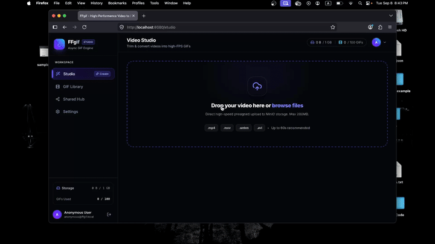
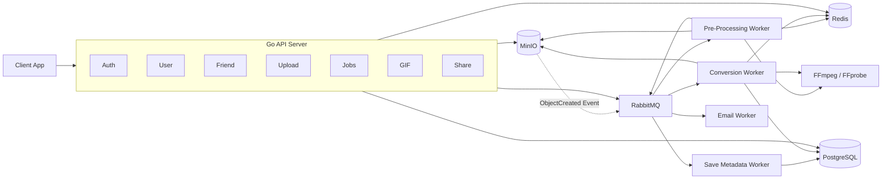
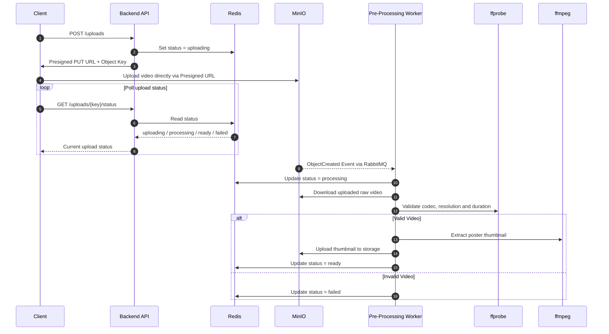
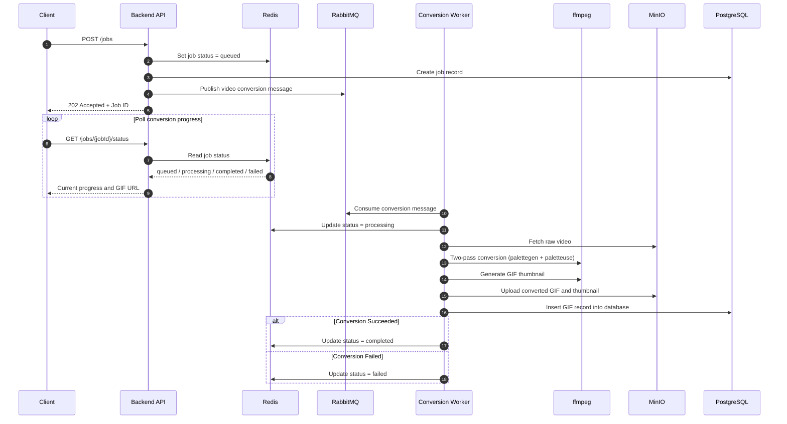

# FFGif

> **Asynchronous Video-to-GIF Conversion & Sharing Platform built with Go, PostgreSQL, MinIO, Redis, RabbitMQ, and FFmpeg.**

<p align="center">
  
  
  
  
  
  
</p>

---

## Overview

**FFgif** is an event-driven video conversion and asset sharing backend. Designed with production-grade backend patterns, it allows users to upload high-definition videos, trim exact time windows, customize framerates and scaling, and convert them asynchronously into GIFs.

---

## Project Demo

<p align="center">
  
</p>

---

## Features

### Authentication & Security
- **JWT-Based Authentication**: Access token generation with secure claims, bearer authorization, and cryptographic token verification.
- **Email Verification Flow**: Account activation workflow with time-limited verification tokens delivered via SMTP / Mailtrap.
- **Password Recovery**: Secure forgot-password / password-reset flow with single-use cryptographic tokens.
- **Instant Token Blocklisting**: Redis-backed token revocation on logout to immediately invalidate active sessions.
- **Enterprise Password Security**: Bcrypt hashing combined with a server-side HMAC secret pepper and configurable work cost.
- **Redis Token-Bucket Rate Limiter**: Server-side atomic rate limiting enforced via embedded Lua scripts to prevent API abuse.

### Zero-Byte Direct Cloud Storage & Ingestion
- **Direct MinIO S3 Presigned Uploads**: Clients upload raw video binaries directly to MinIO object storage—the Go backend never proxies heavy video payloads.
- **Event-Driven Ingestion**: MinIO `s3:ObjectCreated` bucket notifications publish directly to a RabbitMQ fanout exchange, completely decoupling file upload from background processing.
- **Live Upload Status & Streaming**: Real-time polling for upload readiness and instant video streaming via time-limited presigned URLs.
- **Automated Lifecycle Eviction**: MinIO lifecycle configuration automatically purges unprocessed temporary uploads after 24 hours.

### Video-to-GIF Engine
- **Asynchronous Worker Pool**: Multi-threaded RabbitMQ worker queues for video pre-validation, GIF conversion, and email dispatching.
- **Frame-Accurate Video Trimming**: Precision start and duration cropping powered by FFmpeg.
- **Optimized Palette Generation**: Two-pass FFmpeg conversion (`palettegen` + `paletteuse`) ensuring silky-smooth color gradients without banding or artifacts.
- **Full Customization**: Granular control over output framerate (up to 30 FPS), custom dimensions / resolution scaling, and loop count.
- **Automatic Thumbnail Extraction**: Extracts video/GIF poster frames on ingestion for fast frontend previews.

### GIF Management
<!--
- **Ephemeral "Recents" Conversion**: Fast preview conversions saved temporarily without consuming permanent storage quotas. -->
<!-- - **One-Click Persistence**: Seamlessly save and promote temporary preview GIFs into the permanent library. -->
- **Metadata & Analytics**: Track GIF properties, visibility, and download count.
<!-- - **Public & Private Visibility**: Toggle individual GIFs between private user view and public profile galleries. -->

### Sharing
- **Targeted User-to-User Sharing**: Share GIFs with specific registered users with configurable expiration timestamps.
- **Public Share Links (`/s/{token}`)**: Generate shareable, tokenized public links for users outside the platform with download permissions.
- **Instant Revocation**: Owners can revoke shared access at any time without affecting the underlying asset.

### Friends
- **Friend Request Pipeline**: Send, accept, reject, and list incoming friend requests.
- **Friend List Management**: Manage friendships and view accepted connections.
- **User Discovery**: Look up user profiles and explore public GIF galleries by user ID.

<!-- ### Quotas & Account Management
- **Tiered Quota Tracking**: Real-time tracking of daily and total conversion usage against user quotas.
- **Profile Customization**: Update display names, profile details, and manage password changes.
- **Cascading Account Cleanup**: Complete account deletion with automated removal of all associated media and shares from PostgreSQL and MinIO. -->

---

## Architecture

### High-Level System Architecture


```mermaid
flowchart LR
    Client["Client App"]

    subgraph API["Go API Server"]
        Auth["Auth"]
        User["User"]
        Friend["Friend"]
        Upload["Upload"]
        Convert["Jobs"]
        GIF["GIF"]
        Share["Share"]
    end

    PG[("PostgreSQL")]
    Redis[("Redis")]
    MinIO[("MinIO")]
    RabbitMQ["RabbitMQ"]

    PreWorker["Pre-Processing Worker"]
    ConvertWorker["Conversion Worker"]
    SaveWorker["Save Metadata Worker"]
    EmailWorker["Email Worker"]

    FFmpeg["FFmpeg / FFprobe"]

    Client --> API

    API --> PG
    API --> Redis
    API --> MinIO
    API --> RabbitMQ

    %% Upload pipeline
    MinIO -.->|ObjectCreated Event| RabbitMQ
    RabbitMQ --> PreWorker
    PreWorker --> MinIO
    PreWorker --> FFmpeg
    PreWorker --> Redis
    PreWorker --> RabbitMQ
    RabbitMQ --> SaveWorker
    SaveWorker --> PG

    %% Conversion pipeline
    RabbitMQ --> ConvertWorker
    ConvertWorker --> MinIO
    ConvertWorker --> FFmpeg
    ConvertWorker --> Redis
    ConvertWorker --> PG

    %% Email pipeline
    RabbitMQ --> EmailWorker
```

<details>
<summary><strong>Video Upload Workflow</strong></summary>

### Video Upload Workflow


```mermaid
sequenceDiagram
    autonumber

    participant Client
    participant API as Backend API
    participant Redis
    participant MinIO as MinIO
    participant Worker as Pre-Processing Worker
    participant FFProbe as ffprobe
    participant FFmpeg as ffmpeg

    Client->>API: POST /uploads
    API->>Redis: Set status = uploading
    API->>Client: Presigned PUT URL + Object Key

    Client->>MinIO: Upload video directly via Presigned URL

    loop Poll upload status
        Client->>API: GET /uploads/{key}/status
        API->>Redis: Read status
        Redis-->>API: uploading / processing / ready / failed
        API-->>Client: Current upload status
    end

    MinIO-->>Worker: ObjectCreated Event via RabbitMQ

    Worker->>Redis: Update status = processing
    Worker->>MinIO: Download uploaded raw video
    Worker->>FFProbe: Validate codec, resolution and duration
    
    alt Valid Video
        Worker->>FFmpeg: Extract poster thumbnail
        Worker->>MinIO: Upload thumbnail to storage
        Worker->>Redis: Update status = ready
    else Invalid Video
        Worker->>Redis: Update status = failed
    end
```

</details>

<details>
<summary><strong>Video Conversion Workflow</strong></summary>

### Video Conversion Workflow


```mermaid
sequenceDiagram
    autonumber

    participant Client
    participant API as Backend API
    participant Redis
    participant RabbitMQ
    participant Worker as Conversion Worker
    participant FFmpeg as ffmpeg
    participant MinIO
    participant PG as PostgreSQL

    Client->>API: POST /jobs
    API->>Redis: Set job status = queued
    API->>PG: Create job record
    API->>RabbitMQ: Publish video conversion message
    API-->>Client: 202 Accepted + Job ID

    loop Poll conversion progress
        Client->>API: GET /jobs/{jobId}/status
        API->>Redis: Read job status
        Redis-->>API: queued / processing / completed / failed
        API-->>Client: Current progress and GIF URL
    end

    Worker->>RabbitMQ: Consume conversion message
    Worker->>Redis: Update status = processing
    Worker->>MinIO: Fetch raw video
    Worker->>FFmpeg: Two-pass conversion (palettegen + paletteuse)
    Worker->>FFmpeg: Generate GIF thumbnail
    Worker->>MinIO: Upload converted GIF and thumbnail
    Worker->>PG: Insert GIF record into database

    alt Conversion Succeeded
        Worker->>Redis: Update status = completed
    else Conversion Failed
        Worker->>Redis: Update status = failed
    end
```

</details>

---

## Tech Stack

| Component        | Technology                                     |
| ---------------- | ---------------------------------------------- |
| Language         | Golang (Go)                                    |
| HTTP             | `net/http` (stdlib, no framework)              |
| Database         | PostgreSQL via `sqlx`                          |
| Migrations       | `golang-migrate`                               |
| Cache            | Redis via `go-redis`                           |
| Object Storage   | MinIO (`minio-go`)                             |
| Message Queue    | RabbitMQ (`amqp091-go`)                        |
| Video Processing | FFmpeg & FFprobe (via `os/exec`)               |
| Auth             | JWT (`golang-jwt/jwt`) + bcrypt                |
| Email Delivery   | Gomail (`gopkg.in/gomail.v2`) (SMTP + Mailtrap)|
| Validation       | `go-playground/validator`                      |
| Configuration    | `spf13/viper` (`.env` loading)                 |
| CLI              | `spf13/cobra` (`bootstrap` CLI)                |
| Security         | OWASP ZAP (Automatic Scanner)                  |
| Containerization | Docker & Compose                               |

---

## Project Structure

```
.
├── cmd/                            → Application entry points
│   ├── ffgif/                      # Main HTTP API server
│   ├── worker/                     # Async RabbitMQ background workers
│   └── bootstrap/                  # DB migrations & infra bootstrap CLI
├── config/                         → Environment-based configuration loader
├── dist/                           → Static frontend export
├── docs/                           → API specifications & documentation
│   └── openapi.yaml                # OpenAPI 3.0 REST API definition
├── internal/                       → Private application code
│   ├── app/                        → Application use cases & services
│   │   ├── auth/                   # Authentication service (signup, login, reset)
│   │   ├── friend/                 # Friend requests & friendship management service
│   │   ├── media/                  # Video upload, processing & GIF service
│   │   ├── share/                  # GIF sharing & access control service
│   │   └── user/                   # User profile & quota service
│   ├── domain/                     → Core domain entities & repository interfaces
│   │   ├── auth/                   # User, credential & verifier models
│   │   ├── friend/                 # Friend entity models & repository interfaces
│   │   ├── media/                  # GIF, upload & storage models
│   │   ├── share/                  # GIF share models
│   │   └── user/                   # Profile & quota models
│   ├── port/                       → Port interfaces for external adapters
│   │   ├── cache/                  # Cache & rate limiter interfaces
│   │   ├── db/                     # Transaction manager interface
│   │   ├── mailer/                 # Mailer interface
│   │   ├── processor/              # Video & GIF processor interface
│   │   └── queue/                  # Message queue interface
│   ├── infra/                      → Infrastructure adapters & drivers
│   │   ├── ffmpeg/                 # FFmpeg/FFprobe CLI wrapper
│   │   ├── mailer/                 # SMTP / Mailtrap client
│   │   ├── minio/                  # MinIO S3 object storage adapter
│   │   ├── postgres/               # PostgreSQL repositories via sqlx
│   │   ├── rabbitmq/               # RabbitMQ publisher & consumer
│   │   └── redis/                  # Redis cache & Lua token bucket rate limiter
│   ├── transport/                  → Transport layer
│   │   └── http/                   → HTTP server & routing
│   │       ├── handlers/           # HTTP handlers (auth, media, share, user, static)
│   │       ├── httputil/           # JSON response & auth context helpers
│   │       ├── middleware/         # Auth, CORS, rate limiter, logger middlewares
│   │       └── server.go           # Server startup & routing configuration
│   └── worker/                     → RabbitMQ consumers (conversion, preprocessing, email)
├── migrations/                     → PostgreSQL schema migration files
├── pkg/                            → Shared reusable utility packages
│   ├── apperr/                     # Standardized application domain error definitions
│   ├── jwt/                        # JWT token generation & verification
│   ├── password/                   # Bcrypt password hashing with pepper
│   ├── random/                     # Cryptographic ID generator
│   └── token/                      # Random token generator
├── scripts/                        → Automation & deployment scripts
├── tests/                          → Test suites
│   └── integration/                # End-to-end and real infra integration tests
│   └── zap/                        # Automated OWASP ZAP API security scanning
├── .env.example                    # Environment variables template
├── docker-compose.yml              # Local multi-service orchestrator
├── Dockerfile.postgres             # PostgreSQL container for testing
├── Dockerfile.api                  # api + frontend container
├── Dockerfile.bootstrap            # cli container
├── Dockerfile.minio                # minio container
├── Dockerfile.worker               # worker container
├── go.mod                          # Go module dependencies
├── go.sum                          # Go checksums
└── README.md                       # Project documentation
```

---

## Setup

### Prerequisites

- Docker

### Environment Variables

Copy `.env.example` to `.env` and fill in your values:

```bash
cp .env.example .env
```

| Variable | Default / Example | Required | Description |
|---|---|---|---|
| `VERSION` | `1.0.0` | Yes | Application release version |
| `SERVICE_NAME` | `ffgif` | Yes | Service identifier name |
| `ADDR` | `0.0.0.0` | Yes | Server bind address |
| `PORT` | `8080` | Yes | HTTP server listening port |
| `JWT_SECRET` | `secret-key` | Yes | Secret key used for signing & validating JWT tokens |
| `HASH_PEPPER` | `pepper-string` | Yes | Secret pepper added before password hashing |
| `BCRYPT_COST` | `12` | Yes | Work factor / cost for bcrypt hashing |
| `PG_ADDRESS` | `postgres` | Yes | PostgreSQL host address |
| `PG_PORT` | `5432` | Yes | PostgreSQL port |
| `PG_USER` | `ffgif` | Yes | PostgreSQL application username |
| `PG_PASSWORD` | `secret` | Yes | PostgreSQL application password |
| `PG_NAME` | `ffgif` | Yes | PostgreSQL database name |
| `PG_SSLMODE` | `disable` | Yes | PostgreSQL SSL connection mode |
| `PG_SUPERUSER` | `postgres` | Yes | Admin username for schema initialization and `pg_cron` |
| `PG_SUPERDB` | `postgres` | Yes | Superuser default database name |
| `REDIS_ADDR` | `redis:6379` | Yes | Redis host and port for token blocklist, rate limiting & cache |
| `RMQ_ADDR` | `rabbitmq:5672` | Yes | RabbitMQ broker address |
| `RMQ_USER` | `guest` | Yes | RabbitMQ username |
| `RMQ_PASS` | `guest` | Yes | RabbitMQ password |
| `MINIO_ADDR` | `minio:9000` | Yes | Internal MinIO S3 API address |
| `MINIO_ROOT_USER` | `minioadmin` | Yes | MinIO root administrator username |
| `MINIO_ROOT_PASSWORD` | `minioadmin` | Yes | MinIO root administrator password |
| `MINIO_TEMP_BUCKET` | `uploads` | Yes | S3 bucket for incoming video uploads and transient GIFs |
| `MINIO_PERSIST_BUCKET`| `storage` | Yes | S3 bucket for permanently saved user GIFs and thumbnails |
| `MINIO_TEMP_BUCKET_TTL_DAYS` | `1` | No | Automated lifecycle eviction period (days) for temp bucket |
| `MINIO_API_CORS_ALLOW_ORIGIN`| `http://localhost:8080` | Yes | Allowed origins for direct browser S3 uploads and Cors validation |
| `MINIO_NOTIFY_EXCHANGE` | `notify.upload.exchange` | Yes | RabbitMQ fanout exchange for MinIO `s3:ObjectCreated` events |
| `MINIO_PUBLIC_ENDPOINT` | `127.0.0.1:9000` | Yes | Publicly reachable MinIO host for presigned URLs |
| `EMAIL` | `verify@ffgif.com` | Yes | Sender email address for system notifications |
| `SMTP_HOST` | `smtp.gmail.com` | Yes | SMTP server hostname |
| `SMTP_PORT` | `587` | Yes | SMTP server port |
| `SMTP_USER` | `ffgif@gmail.com` | Yes | SMTP authentication username |
| `SMTP_PASS` | `app-password` | Yes | SMTP authentication password |
| `MAILTRAP_USERNAME` | `mailtrap-user` | No | Mailtrap sandbox username (alternative to SMTP) |
| `MAILTRAP_PASSWORD` | `mailtrap-pass` | No | Mailtrap sandbox password |

### Build And Run

minio image is now archied, so i build the container from their github repo, and it takes almost **9-10 minutes to start**.

```
docker compose up -d --build
```

### Run

```
docker compose up
```

### Docker services

```
services:
  postgres:   → PostgreSQL
  redis:      → Redis
  rabbitmq:   → RabbitMQ
  minio       → MinIO
  bootstrap:  → CLI to setup postgres, redis and rabbitmq
  api:        → API backend and frontend
  worker:     → async job workers
```

### Demo login

```
Email: anonymous@ffgif.local
Pass: anonymous@ffgif
```

### Mail send

```
Option 1: Mailtrap sandbox (good for local testing)
→ sign up at https://mailtrap.io/
→ use mailer.NewMailtrap(cnf)

Option 2: Real SMTP (e.g. Gmail app password)
→ goto  https://myaccount.google.com/apppasswords
→ get new password for mail
→ use mailer.NewSmtpMailer(cnf)
```

---

## Running Tests

### Unit & Package Tests (No Docker Required)

Runs domain, application, transport, and utility unit tests using mocks:

```bash
# Run all unit and package tests
go test -count=1 ./internal/... ./pkg/...

# Run with verbose output and coverage
go test -v -cover ./internal/... ./pkg/...

# Run specific package tests
go test -v ./internal/transport/http/...
go test -v ./internal/app/auth/...
go test -v ./internal/app/media/...
go test -v ./internal/infra/ffmpeg/...
```

### Integration Tests (Docker Required)

Integration tests interact with real PostgreSQL, Redis, RabbitMQ, and MinIO instances:

```bash
# 1. Ensure Docker infrastructure services are running
docker compose up -d

# 2. Run the integration test suite
go test -v ./tests/integration/...
```

### ZAP Security Scan

```
# Make sure your docker services are running
docker compose up -d

# Run the ZAP API scan
./tests/zap/run_zap.sh
```

---

## API Overview

Base URL: `http://localhost:8080`

| Endpoint | Method | Role | Description |
|---|---|---|---|
| `/auth/signup` | `POST` | Public | Registers new user and queues email verification token |
| `/auth/login` | `POST` | Public | Authenticates credentials and returns JWT access token |
| `/auth/logout` | `POST` | Authenticated | Logs out user and blocklists JWT token in Redis |
| `/auth/verify` | `GET` | Public | Verifies user email address via token query parameter (`?token=`) |
| `/auth/verify/resend` | `POST` | Public | Resends account verification email |
| `/auth/forgot-password` | `POST` | Public | Triggers password reset email with secure token |
| `/auth/reset` | `GET` | Public | Validates password reset token (`?token=`) |
| `/auth/reset` | `POST` | Public | Sets new account password with verified reset token |
| `/users/me/profile` | `GET` | Authenticated | Retrieves current authenticated user profile |
| `/users/me/profile` | `PATCH` | Authenticated | Updates user profile details (fullname, avatar) |
| `/users/:userId/profile` | `GET` | Authenticated | Retrieves public profile information of another user |
| `/users/me/quota` | `GET` | Authenticated | Returns current conversion quotas and tier limits |
| `/users/me/change-password`| `PATCH` | Authenticated | Updates password using old and new credentials |
| `/users/me` | `DELETE` | Authenticated | Permanently deletes user account and all stored media |
| `/friends` | `GET` | Authenticated | Lists all accepted friends for the user |
| `/friends/requests` | `POST` | Authenticated | Sends a new friend request to target user |
| `/friends/requests` | `GET` | Authenticated | Lists pending incoming friend requests |
| `/friends/requests/:id` | `PATCH` | Authenticated | Accepts an incoming friend request |
| `/friends/requests/:id` | `DELETE` | Authenticated | Rejects or cancels a friend request |
| `/friends/:id` | `DELETE` | Authenticated | Removes a user from friend list |
| `/uploads` | `POST` | Authenticated | Generates presigned MinIO PUT URL for direct video upload |
| `/uploads/:key/status` | `GET` | Authenticated | Polls upload validation, duration, and thumbnail status |
| `/uploads/:key/stream` | `GET` | Authenticated | Returns presigned stream URL for raw video preview |
| `/uploads/last` | `GET` | Authenticated | Retrieves metadata of the user's most recent video upload |
| `/jobs` | `POST` | Authenticated | Enqueues async FFmpeg video-to-GIF conversion job |
| `/jobs/:jobId/status` | `GET` | Authenticated | Polls conversion job status (`pending`, `processing`, `completed`) |
| `/gifs/me` | `GET` | Authenticated | Lists all permanent GIFs owned by authenticated user |
| `/gifs/me/recents` | `GET` | Authenticated | Lists recently converted temporary GIFs |
| `/gifs/me/recents/:key/save` | `POST` | Authenticated | Persists a temporary recent GIF to permanent storage |
| `/gifs/user/:userId` | `GET` | Authenticated | Lists public GIFs belonging to a specific user |
| `/gifs/me/:key` | `GET` | Authenticated | Retrieves metadata and properties of a specific GIF |
| `/gifs/me/:key` | `PATCH` | Authenticated | Updates GIF metadata or visibility (`public`/`private`) |
| `/gifs/me/:key` | `DELETE` | Authenticated | Deletes a GIF and purges associated MinIO files |
| `/gifs/me/:key/download` | `GET` | Authenticated | Generates a time-limited presigned download URL |
| `/gifs/me/:key/thumbnail` | `GET` | Authenticated | Generates a presigned URL for GIF thumbnail preview |
| `/gifs/me/:key/shares` | `POST` | Authenticated | Shares a GIF with a specific registered user with expiry |
| `/gifs/me/shares` | `GET` | Authenticated | Lists all GIFs shared by or shared with the authenticated user |
| `/gifs/me/:key/shares/:shareWithId` | `DELETE` | Authenticated | Revokes shared access for a specific user |
| `/s` | `POST` | Authenticated | Creates a public token-based share link |
| `/s/:token` | `GET` | Public | Views public shared GIF metadata via token |
| `/s/:token/download` | `GET` | Public | Downloads public shared GIF via token |
| `/health` | `GET` | Public | Liveness / readiness health check endpoint |
| `/` | `GET` | Public | Serves web application and static assets |

---

## Known Limitations

- **Presigned Upload Ceilings**: MinIO presigned PUT URLs currently lack content-length-range enforcement; large uploads rely on client compliance before processing.
- **Polling-Based Status**: Clients currently poll `GET /jobs/{jobId}/status` and `GET /uploads/{key}/status` rather than receiving real-time push events.
- **Pagination**: List endpoints (`/gifs/me`, `/gifs/me/shares`) currently return unpaginated datasets.
- **Ephemeral GIF Retention**: Unpersisted (`persist = false`) GIFs do not yet have an automated MinIO lifecycle eviction rule after 24 hours.
- **Guest Session Scope**: Anonymous accounts have temporary 24-hour quotas and cannot access email-based features (password resets, notifications) without account registration.
- **Local Development TLS**: Local Docker environment runs over HTTP; production deployments require an SSL/TLS reverse proxy (e.g., Caddy or Nginx).
- **Health Check**: Currently health check endpoint is stub.
- **GIF**: Public share is stub. currently all gif's are private and saved parmanently.
- **Testing**: Some tests are failing, need to fix. Also the security testing needs to configure.
- **Download and Preview endpoint**: download endpoint calling on preview, which increases download count on preview, currently diabled, but preview also needed to disable.
- **No cleaup expired data**: Database lacks to clean up expiry rows.
- **Retry-mechanism**: Retry mechanism has bug, it retries infinitive.

---

## Planned / Future Work

- **Real-Time Updates**: Replace polling with WebSockets or Server-Sent Events (SSE) for conversion job progress.
- **Export Formats**: Support WebP, APNG, and reverse GIF-to-MP4 conversions.
- **Rich GIF Editing**: Add text overlays, captions, speed adjustments, and filters via FFmpeg.
- **Smart Discovery**: AI/vector-based semantic search and GIF recommendations.
- **Webhooks**: Outbound webhooks on job completion for third-party integrations.
- **Observability**: Prometheus metrics export and Grafana dashboard for conversion latency, queue depth, and storage usage.
- **Full Next.js Frontend Integration**: Complete the web UI with drag-and-drop video trimmer, share link previews, and friendship management.
- **Migration**: Migrate to GIN framework.