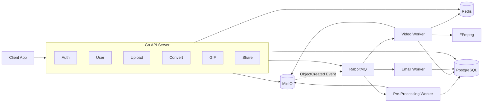
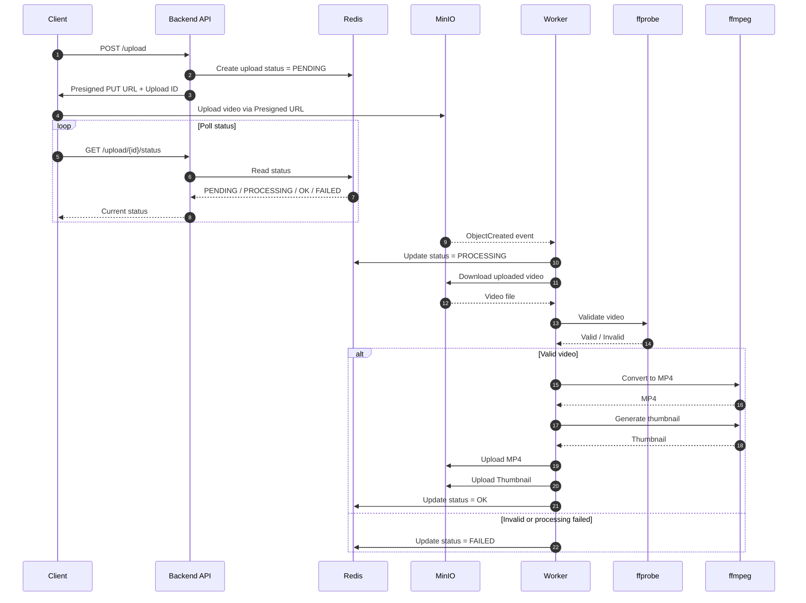
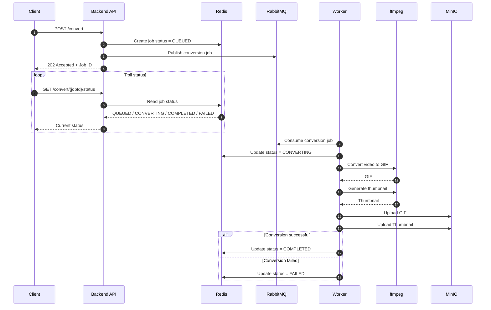

# FFGif

A video-to-GIF conversion platform. Users upload videos, configure conversion parameters (start/end time, FPS, width, loop), and receive a GIF which can be downloaded and shared. Built to explore async job processing, object storage, and production-grade backend patterns in Go.

---

## Project Demo

<p align="center">
  
</p>

---

## Features

- **JWT-based Authentication:** Signup with email verification, login, forgot/reset password flow, and token blocklisting on logout (Redis-backed)
- **Presigned URL upload and download flow:** Client uploads and downloads directly from MinIO, backend never touches the bytes
- **Event-driven ingestion:** MinIO bucket notifications trigger RabbitMQ on upload, decoupling ingestion from processing
- **Async GIF conversion via RabbitMQ worker pool:** FFmpeg processes video locally, result uploaded back to MinIO
- **GIF management:** list, get, delete, visibility status (public/private), download URL, sharing with others users or publicly by email
- **GIF sharing with access control:** owners can grant time-limited access to another registered user or publicly; shared recipients can download without owning the GIF
- **Rate Limiter:** Redis token bucket rate limiter implemented via a Lua script for atomic server-side enforcement
- **Email delivery** via SMTP (Mailtrap sandbox or SMTP)

---

## Architecture

### High-Level System Architecture


```mermaid
flowchart LR

    Client["Client App"]

    subgraph API["Go API Server"]
        Auth["Auth"]
        User["User"]
        Upload["Upload"]
        Convert["Convert"]
        GIF["GIF"]
        Share["Share"]
    end

    PG[("PostgreSQL")]
    Redis[("Redis")]
    MinIO[("MinIO")]
    RabbitMQ["RabbitMQ"]

    PreWorker["Pre-Processing Worker"]
    VideoWorker["Video Worker"]
    EmailWorker["Email Worker"]

    FFmpeg["FFmpeg"]

    Client --> API

    API --> PG
    API --> Redis
    API --> MinIO
    API --> RabbitMQ

    %% Upload pipeline
    MinIO -. ObjectCreated Event .-> RabbitMQ
    RabbitMQ --> PreWorker
    PreWorker --> MinIO
    PreWorker --> PG

    %% Conversion pipeline
    RabbitMQ --> VideoWorker
    VideoWorker --> MinIO
    VideoWorker --> FFmpeg
    VideoWorker --> Redis
    VideoWorker --> PG

    %% Email pipeline
    RabbitMQ --> EmailWorker
    EmailWorker --> PG
```

<details>
<summary><strong>Video Upload Workflow</strong></summary>


```mermaid
sequenceDiagram
    autonumber

    participant Client
    participant API as Backend API
    participant Redis
    participant MinIO as MinIO
    participant Worker
    participant FFProbe as ffprobe
    participant FFmpeg as ffmpeg

    Client->>API: POST /upload
    API->>Redis: Create upload status = PENDING
    API->>Client: Presigned PUT URL + Upload ID

    Client->>MinIO: Upload video via Presigned URL

    loop Poll status
        Client->>API: GET /upload/{id}/status
        API->>Redis: Read status
        Redis-->>API: PENDING / PROCESSING / OK / FAILED
        API-->>Client: Current status
    end

    MinIO-->>Worker: ObjectCreated event

    Worker->>Redis: Update status = PROCESSING

    Worker->>MinIO: Download uploaded video
    MinIO-->>Worker: Video file

    Worker->>FFProbe: Validate video
    FFProbe-->>Worker: Valid / Invalid

    alt Valid video
        Worker->>FFmpeg: Convert to MP4
        FFmpeg-->>Worker: MP4

        Worker->>FFmpeg: Generate thumbnail
        FFmpeg-->>Worker: Thumbnail

        Worker->>MinIO: Upload MP4
        Worker->>MinIO: Upload Thumbnail

        Worker->>Redis: Update status = OK
    else Invalid or processing failed
        Worker->>Redis: Update status = FAILED
    end
```

</details>

<details>
<summary><strong>Video Conversion Workflow</strong></summary>


```mermaid
sequenceDiagram
    autonumber

    participant Client
    participant API as Backend API
    participant Redis
    participant RabbitMQ
    participant Worker
    participant FFmpeg as ffmpeg
    participant MinIO

    Client->>API: POST /convert
    API->>Redis: Create job status = QUEUED
    API->>RabbitMQ: Publish conversion job
    API-->>Client: 202 Accepted + Job ID

    loop Poll status
        Client->>API: GET /convert/{jobId}/status
        API->>Redis: Read job status
        Redis-->>API: QUEUED / CONVERTING / COMPLETED / FAILED
        API-->>Client: Current status
    end

    Worker->>RabbitMQ: Consume conversion job

    Worker->>Redis: Update status = CONVERTING

    Worker->>FFmpeg: Convert video to GIF
    FFmpeg-->>Worker: GIF

    Worker->>FFmpeg: Generate thumbnail
    FFmpeg-->>Worker: Thumbnail

    Worker->>MinIO: Upload GIF
    Worker->>MinIO: Upload Thumbnail

    alt Conversion successful
        Worker->>Redis: Update status = COMPLETED
    else Conversion failed
        Worker->>Redis: Update status = FAILED
    end
```

</details>

---

## Tech Stack

| Component        | Technology                               |
| ---------------- | ---------------------------------------- |
| Language         | Go                                       |
| HTTP             | `net/http` (stdlib, no framework)        |
| Database         | PostgreSQL via `sqlx`                    |
| Migrations       | `golang-migrate`                         |
| Cache            | Redis via `go-redis`                     |
| Object Storage   | MinIO (`minio-go`)                       |
| Message Queue    | RabbitMQ (`amqp091-go`)                  |
| Video Processing | FFmpeg (via `os/exec`)                   |
| Auth             | JWT (`golang-jwt/jwt`) + bcrypt + pepper |
| Validation       | `go-playground/validator`                |
| Email            | Mailtrap (SMTP sandbox)                  |

---

## Project Structure

```
.
├── cmd/                            → Application entry points
│   ├── ffgif/                      # Main HTTP API server
│   ├── worker/                     # Async RabbitMQ background workers
│   └── bootstrap/                  # DB migrations & infra bootstrap CLI
├── config/                         → Environment-based configuration loader
├── dist/                           → Static frontend export
├── internal/                       → Private application code
│   ├── app/                        → Application use cases & services
│   │   ├── auth/                   # Authentication service (signup, login, reset)
│   │   ├── media/                  # Video upload, processing & GIF service
│   │   ├── share/                  # GIF sharing & access control service
│   │   └── user/                   # User profile & quota service
│   ├── domain/                     → Core domain entities & repository interfaces
│   │   ├── auth/                   # User, credential & verifier models
│   │   ├── media/                  # GIF, upload & storage models
│   │   ├── share/                  # GIF share models
│   │   └── user/                   # Profile & quota models
│   ├── port/                       → Port interfaces for external adapters
│   │   ├── cache/                  # Cache & rate limiter interfaces
│   │   ├── db/                     # Transaction manager interface
│   │   ├── mailer/                 # Mailer interface
│   │   ├── processor/              # Video & GIF processor interface
│   │   └── queue/                  # Message queue interface
│   ├── infra/                      → Infrastructure adapters & drivers
│   │   ├── ffmpeg/                 # FFmpeg/FFprobe CLI wrapper
│   │   ├── mailer/                 # SMTP / Mailtrap client
│   │   ├── minio/                  # MinIO S3 object storage adapter
│   │   ├── postgres/               # PostgreSQL repositories via sqlx
│   │   ├── rabbitmq/               # RabbitMQ publisher & consumer
│   │   └── redis/                  # Redis cache & Lua token bucket rate limiter
│   ├── transport/                  → Transport layer
│   │   └── http/                   → HTTP server & routing
│   │       ├── handlers/           # HTTP handlers (auth, media, share, user, static)
│   │       ├── httputil/           # JSON response & auth context helpers
│   │       ├── middleware/         # Auth, CORS, rate limiter, logger middlewares
│   │       └── server.go           # Server startup & routing configuration
│   └── worker/                     → RabbitMQ consumers (conversion, preprocessing, email)
├── migrations/                     → PostgreSQL schema migration files
├── pkg/                            → Shared reusable utility packages
│   ├── jwt/                        # JWT token generation & verification
│   ├── password/                   # Bcrypt password hashing with pepper
│   ├── random/                     # Cryptographic ID generator
│   └── token/                      # Random token generator
├── scripts/                        → Automation & deployment scripts
├── tests/                          → Test suites
│   └── integration/                # End-to-end and real infra integration tests
├── .env.example                    # Environment variables template
├── docker-compose.yml              # Local multi-service orchestrator
├── Dockerfile                      # Multi-stage Go build container
├── go.mod                          # Go module dependencies
├── go.sum                          # Go checksums
└── README.md                       # Project documentation
```

---

## Setup

### Prerequisites

- Docker

### Environment

Copy `.env.example` to `.env` and fill in your values:

```env
VERSION=                        # Project version
SERVICE_NAME=                   # Project name
ADDR=
PORT=

JWT_SECRET=                     # Auth
HASH_PEPPER=
BCRYPT_COST=

PG_USER=                        # PostgreSql
PG_PASSWORD=
PG_PORT=
PG_ADDRESS=
PG_NAME=
PG_SSLMODE=

PG_SUPERUSER=
PG_SUPERDB=

REDIS_ADDR=                     # Redis

EMAIL=                          # Mailtrap
MAILTRAP_USERNAME=
MAILTRAP_PASSWORD=

MINIO_ADDR=                     # Minio
MINIO_ROOT_USER=
MINIO_ROOT_PASSWORD=
MINIO_TEMP_BUCKET=              # raw upload bucket
MINIO_PERSIST_BUCKET=           # mp4 converted storage bucket
MINIO_TEMP_BUCKET_TTL_DAYS=     # time to delete raw uploaded file
MINIO_API_CORS_ALLOW_ORIGIN=    # minio cors
MINIO_NOTIFY_EXCHANGE=          # rabbitmq exhange name where minio will send notification
MINIO_PUBLIC_ENDPOINT=          # rabbitmq public endpoint where client requests

RMQ_ADDR=                       # Rabbitmq
RMQ_USER=
RMQ_PASS=

SMTP_HOST=                      # SMTP for sending email
SMTP_PORT=
SMTP_USER=
SMTP_PASS=
```

### Build And Run

```
docker compose up -d --build
```

### Run

```
docker compose up
```

### Docker services

```
services:
  postgres:   → PostgreSQL
  redis:      → Redis
  rabbitmq:   → RabbitMQ
  minio       → MinIO
  bootstrap:  → CLI to setup postgres, redis and rabbitmq
  api:        → API backend and frontend
  worker:     → async job workers
```

### Demo login

```
Email: anonymous@ffgif.local
Pass: anonymous@ffgif
```

### Mail send

```
Option 1: Mailtrap sandbox (good for local testing)
→ sign up at https://mailtrap.io/
→ use mailer.NewMailtrap(cnf)

Option 2: Real SMTP (e.g. Gmail app password)
→ goto  https://myaccount.google.com/apppasswords
→ get new password for mail
→ use mailer.NewSmtpMailer(cnf)
```

---

## Running Tests

### Unit & Package Tests (No Docker Required)

Runs domain, application, transport, and utility unit tests using mocks:

```bash
# Run all unit and package tests
go test ./internal/... ./pkg/...

# Run with verbose output and coverage
go test -v -cover ./internal/... ./pkg/...

# Run specific package tests
go test -v ./internal/transport/http/...
go test -v ./internal/app/auth/...
go test -v ./internal/app/media/...
go test -v ./internal/infra/ffmpeg/...
```

### Architecture Tests

Validates clean architecture package boundaries and import rules:

```bash
go test -v ./tests/architecture/...
```

### Integration Tests (Docker Required)

Integration tests interact with real PostgreSQL, Redis, RabbitMQ, and MinIO instances:

```bash
# 1. Ensure Docker infrastructure services are running
docker compose up -d

# 2. Run the integration test suite
go test -v ./tests/integration/...
```

---

## API Reference

### Auth

```
POST   /auth/signup
POST   /auth/login
POST   /auth/logout                     (auth required)
GET    /auth/verify?token=
POST   /auth/verify/resend
POST   /auth/forgot-password
GET    /auth/reset?token=
POST   /auth/reset
```

### User

```
GET    /users/me/profile                (auth required)
PATCH  /users/me/profile                (auth required)
GET    /users/{userId}/profile
GET    /users/me/quota                  (auth required)
PATCH  /users/me/change-password        (auth required)
DELETE /users/me                        (auth required)
```

### Friends

```
POST   /friends/requests                send friend request (auth required)
GET    /friends/requests                list incoming friend requests (auth required)
PATCH  /friends/requests/{id}           accept friend request (auth required)
DELETE /friends/requests/{id}           reject friend request (auth required)
GET    /friends                         list all accepted friends (auth required)
DELETE /friends/{id}                    remove friend (auth required)
```

### Uploads

```
POST   /uploads                         presigned URL generation (auth required)
GET    /uploads/{key}/status            poll upload status (auth required)
GET    /uploads/{key}/stream            presigned URL streaming (auth required)
GET    /uploads/last                    last uploaded video metadata (auth required)
```

### Convert & Jobs

```
POST   /jobs                            enqueue conversion job (auth required)
GET    /jobs/{jobId}/status             poll job status (auth required)
```

### GIFs

```
GET    /gifs/me                         list my GIFs (auth required)
GET    /gifs/me/recents                 list recently converted GIFs (auth required)
GET    /gifs/user/{userId}              list public GIFs of a user (auth required)
GET    /gifs/me/{key}                   get GIF metadata (auth required)
GET    /gifs/me/{key}/download          presigned download URL (auth required)
GET    /gifs/me/{key}/thumbnail         presigned thumbnail URL (auth required)
PATCH  /gifs/me/{key}                   update GIF metadata / visibility (auth required)
DELETE /gifs/me/{key}                   delete GIF (auth required)
POST   /gifs/me/recents/{key}/save      persist temporary recent GIF (auth required)
```

### Shares

```
POST   /gifs/me/{key}/shares                    share a GIF with a user (auth required)
GET    /gifs/me/shares                          list all GIFs shared by / with user (auth required)
DELETE /gifs/me/{key}/shares/{shareWithId}      revoke shared access for a user (auth required)
POST   /s                                       create public share token (auth required)
GET    /s/{token}                               view public shared GIF (auth required)
GET    /s/{token}/download                      download public shared GIF (auth required)
```

### System

```
GET    /health                          health check endpoint
```

---

## Known Limitations

- **Presigned Upload Ceilings**: MinIO presigned PUT URLs currently lack content-length-range enforcement; large uploads rely on client compliance before processing.
- **Polling-Based Status**: Clients currently poll `GET /jobs/{jobId}/status` and `GET /uploads/{key}/status` rather than receiving real-time push events.
- **Pagination**: List endpoints (`/gifs/me`, `/gifs/me/shares`) currently return unpaginated datasets.
- **Ephemeral GIF Retention**: Unpersisted (`persist = false`) GIFs do not yet have an automated MinIO lifecycle eviction rule after 24 hours.
- **Guest Session Scope**: Anonymous accounts have temporary 24-hour quotas and cannot access email-based features (password resets, notifications) without account registration.
- **Local Development TLS**: Local Docker environment runs over HTTP; production deployments require an SSL/TLS reverse proxy (e.g., Caddy or Nginx).
- **Health Check**: Currently health check endpoint is stub.
- **GIF**: Public share is stub.

---

## Planned / Future Work

- **Real-Time Updates**: Replace polling with WebSockets or Server-Sent Events (SSE) for conversion job progress.
- **Export Formats**: Support WebP, APNG, and reverse GIF-to-MP4 conversions.
- **Rich GIF Editing**: Add text overlays, captions, speed adjustments, and filters via FFmpeg.
- **Smart Discovery**: AI/vector-based semantic search and GIF recommendations.
- **Webhooks**: Outbound webhooks on job completion for third-party integrations.
- **Observability**: Prometheus metrics export and Grafana dashboard for conversion latency, queue depth, and storage usage.
- **Full Next.js Frontend Integration**: Complete the web UI with drag-and-drop video trimmer, share link previews, and friendship management.
